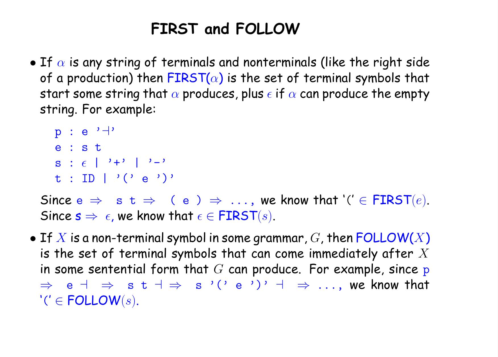
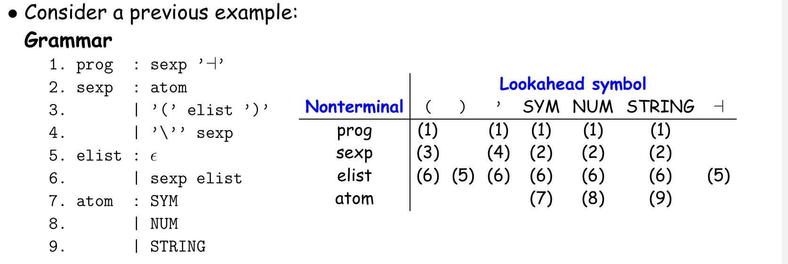

# 词法分析
即把语言分解成最小单元

DFA:字符串只会唯一对应FA中某个唯一的结点
NFA:字符串可能对应FA中多个结点

# 语法分析
如果在语法G中，一个串可以对应两种推导语法分析树，那么这个语法G是有歧义的。


## Top-down Parse
top-down:从非结束符推导出字符串

语法G
prog : sexp '\'
sexp : atom 
        | '(' sexp
atom : SYM
        | NUM
        | STRING

next() 读字符(该字符为储存到函数中的数据)，不改变next()中的数据，即如果不调用scan(x),next()永远返回同样的值。
scan(x) 读下一个字符，检查它是否为x，并读取下一个token到next()的数据中。

**替换函数**对应语法G中相应的production
```py
def prog():
    sexp();scan('\')

def sexp():
    if next() in [SYM, NUM, STRING] :
        atom()
    elif next() == '(' :
        scan('('); sexp();

def atom():
    if next() in [SYM, NUM, STRING] :
        scan(next())        
```

### 如何使用替换函数

**结束符：无法通过语法G替换的符号**



**FIRST**(X):X通过语法G能产生的**序列的开头的集合（必须为结束符）**
X是非结束符或结束符

**FOLLOW**(X)：通过语法G能产生的序列中能**恰好跟在X后面的结束符**的集合
X必须是非结束符

如何使用：
1. 选择语法中的替换函数时，当下一个字符在某个替换函数的FIRST()中，选择该替换函数。
2. 如果FIRST()中包含空，选择该替换函数如果下一个字符在FOLLOW()中。

### 如何编写替换函数
语法G
e : t
    | t '/' e
    | t '*' e

t : I

``` py
def e():
    r = t()
    while next() in ['\', '*'] : 
        if next() == '/' :
            scan('/'); t1 = t()
            r = makeTree(DIVISION, r, t1)
        else: 
            scan('*'); t1 = t()
            r = makeTree(MULTIPLY, r, t1)
```
该替换函数解决的问题：
1. 用next()判断解决了语法中的选项选择
2. 读入后立即调用makeTree()解决了歧义问题，即不把 a / b / c 翻译成 a / (b / c)

### LL(1)
top-down parse, we call it LL(1)

LL1: input can be processed from **L**eft to right, producing a **L**eftmost derivation, and checking **1** symbol ahead to see which branch to take.


```py
#general LL1 program
Table T 
Grammar G
def LLParse(x) :
    if x is terminal :
        scan(x)
    else : #nonterminal

        process = T[x][next()] # 如果不存在 报错
        
        # p1...pn为process的右边
        for i in range(n):
            LLParse(pi)
```


## Bottom-up Parse
bottom-up:从字符串推导出非结束符

1. 根据文法得到DFA，并将DFA转换为DFA Table方便后续使用
2. 读字符串入栈，根据DFA Table进行移位(shift)或者化简(reduce)


Parse(A, S)
A: 非结束符
S: 字符串

parse(A, S) 返回从A推导能得到的S子串的长度
```py
# Earley's Algorithm
def parse(a * b, s, k):
'''
a * b:production
s: a能产生序列Cs...Ck
k: b产生序列Ck+1....Cj 
parse返回值j 
'''
    if b is empty:
        return k

    # b = x * o
    if x is a terminal:
        if x == ck+1:
            return parse(ax * o, s, k + 1)
        else:
            GIVE UP
    else:
    # x is nonterminal
    # choose production 'x : u'

        j = parse( * u, k, k)
        # parse( * u, k, k) return j in Ck+1...Cj where u can produce
        return parse(ax * o, s, j)
      
```

### LR(1)
bottop-up parse, we call it LR(1)
LR(1):scan the input from **L**eft to right, produding a (reverse) **R**ightmost derivation, using **1** symbol of lookingahead.

LR(1) item: X:a * b, c
X:a * b 是一个生产
c:跟在X之后的一个结束符

X:a * b, c 意思是在语法栈上已经得到a，现在期望读入能从bc推导来的非结束符前缀

### shift & reduce
shift:读入新的字符
reduce:将已经读入的字符末尾转换为非结束符

